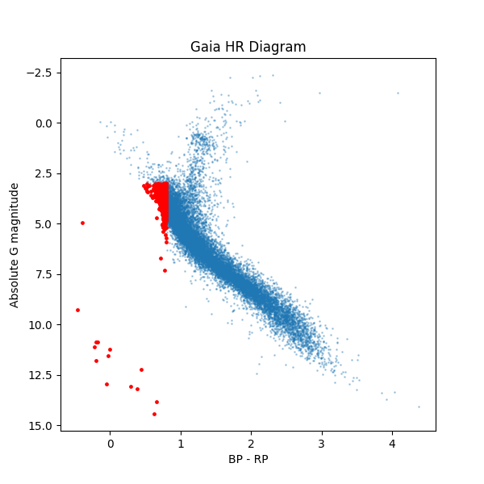
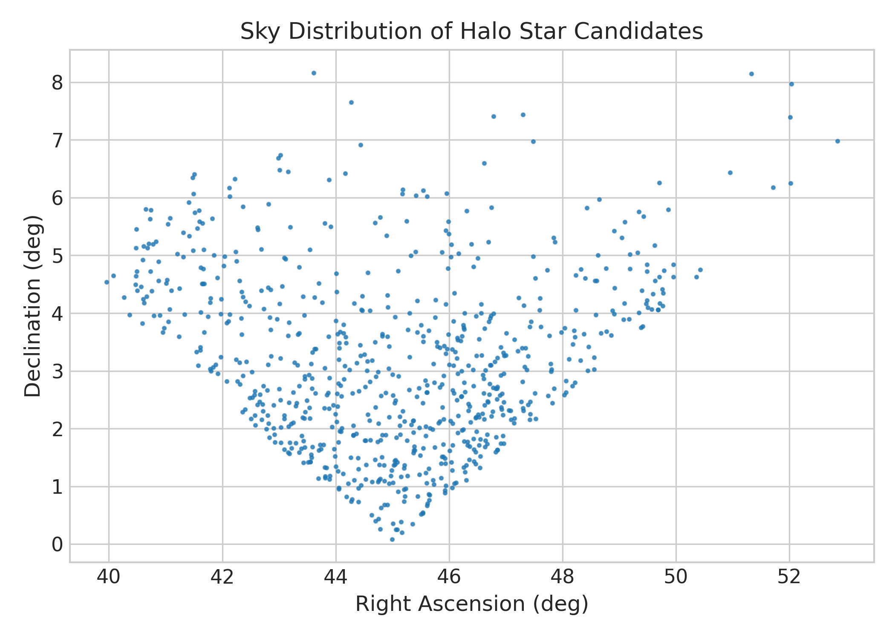

# Data-driven classification of Milky Way halo stars using Gaia DR3

This project presents a Python-based analysis pipeline for identifying Milky Way halo star candidates
using astrometric and photometric data from the Gaia DR3 survey.

## Methodology
- Queried Gaia DR3 data using astroquery
- Applied quality filtering on parallaxes
- Computed distances and absolute magnitudes
- Identified halo candidates using color–magnitude selection
- Visualized results through HR diagrams

## Outputs
- HR diagram highlighting halo star candidates
- Clean catalog of halo stars in CSV format

## Tools
Python, Pandas, NumPy, Matplotlib, Astroquery

## Sample Results

### Hertzsprung–Russell Diagram

### Sky Distribution of Halo Star Candidates

